# 🤖 Activité Pratique N°2 – Chatbot Spring AI MCP + RAG + Telegram + Micro-services

Ce dépôt présente l’implémentation complète d’un **Chatbot intelligent** utilisant **Spring AI**, **MCP (Model Context Protocol)**, un système **RAG**, une intégration **Telegram Bot**, et une connexion avec l’architecture **Micro-services** de l’activité pratique N°1.

Activité réalisée dans le cadre du cours **Architecture Micro-services** encadré par **Mr YOUSSFI Mohamed**.

---

## 🧩 Objectifs de l’activité

1️⃣ Développer un **Chatbot Spring Boot** basé sur Spring AI + MCP  
2️⃣ Ajouter un **système RAG** avec recherche vectorielle  
3️⃣ Intégrer le chatbot dans l’**architecture Micro-services** de l’activité pratique N°1  
4️⃣ Ajouter l’intégration **Telegram Bot** avec actions typing et streaming

---

# 🧠 1. Chatbot Spring AI + MCP

Le chatbot expose plusieurs capacités via MCP Tools :

- Récupération d’informations (employé, factures…)  
- Appels aux micro-services internes  
- Mode streaming  
- Gestion mémoire (store.json)

### 📸 Exemples – Tools et requêtes

| GET Employee Tool | List Employees Tool | 
|---|---|
| 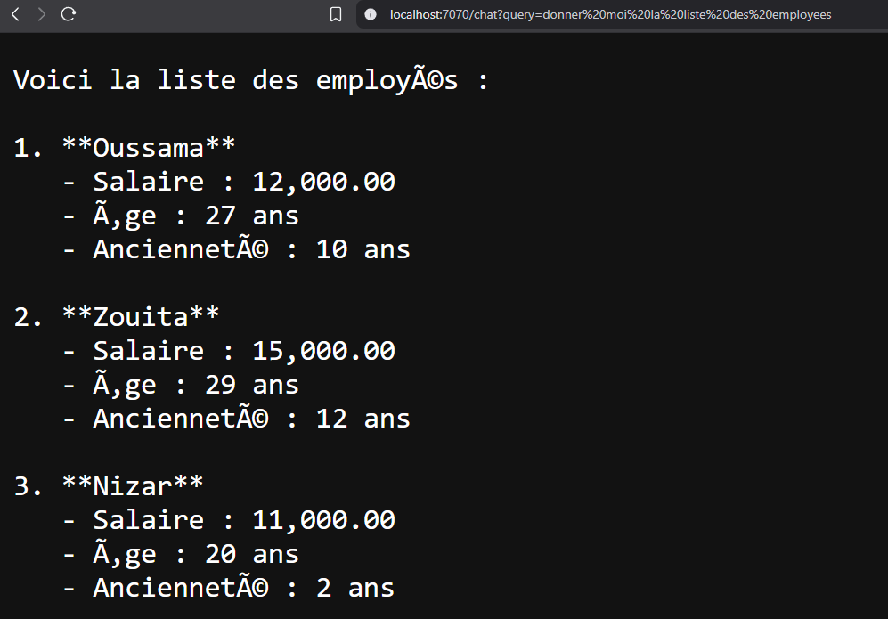 | 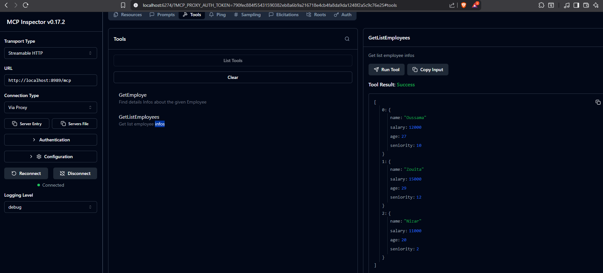 |

| Synchrone |Streaming |
|---|---|
| 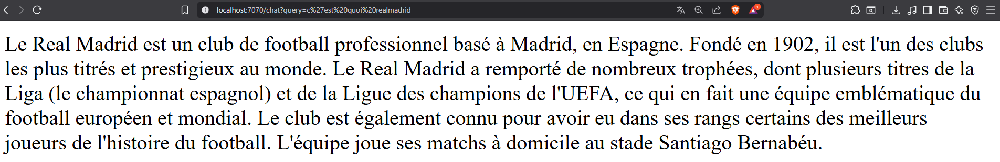 | 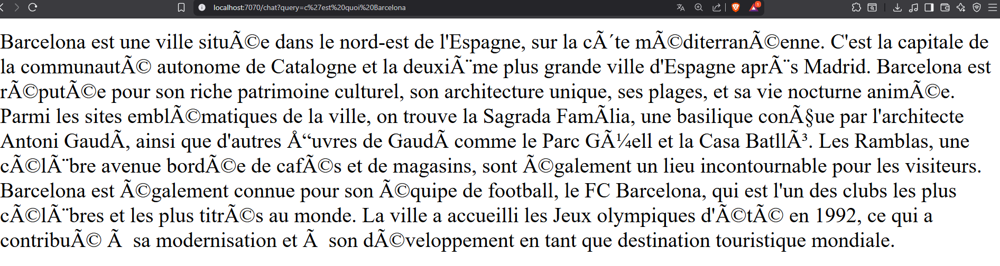 |

---

# 📚 2. Système RAG (Retrieval-Augmented Generation)

Le projet inclut un système RAG permettant :

- L’indexation de documents (PDF, JSON…)  
- La création automatique d’un **vector store local**  
- La recherche sémantique à chaque requête  
- Une réponse enrichie par le contexte documentaire

### 📸 Exemples RAG

| RAG Overview | Vector Store |
|---|---|
| 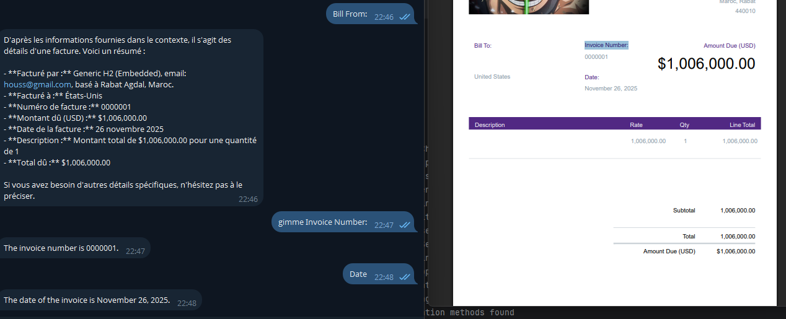 | 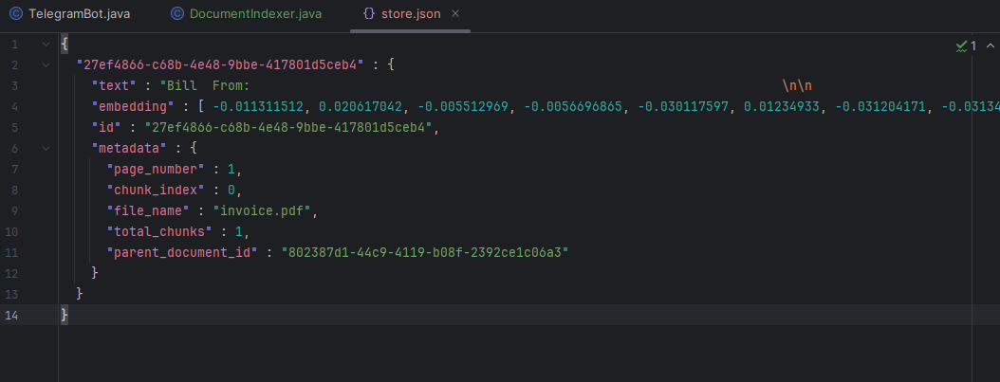 |

| Question avec Mémoire | Réponse Mémoire + RAG |
|---|---|
| 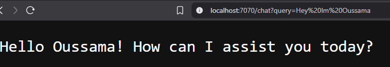 | 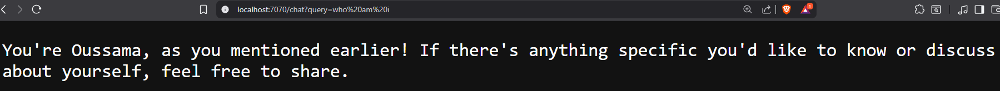 |

---

# 💬 3. Intégration Telegram Bot

Le chatbot communique avec Telegram via :

- Webhook ou polling  
- Réponses avec markdown  
- Support du streaming  
- Actions typing

### 📸 Capture Telegram

| Telegram Bot | Bill From |Typing Action | rag |
|---|---|---|---|
| 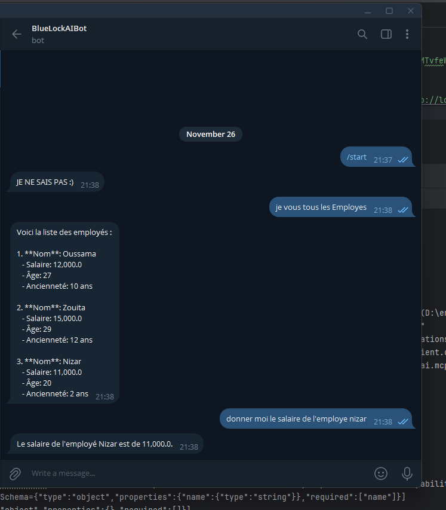 | 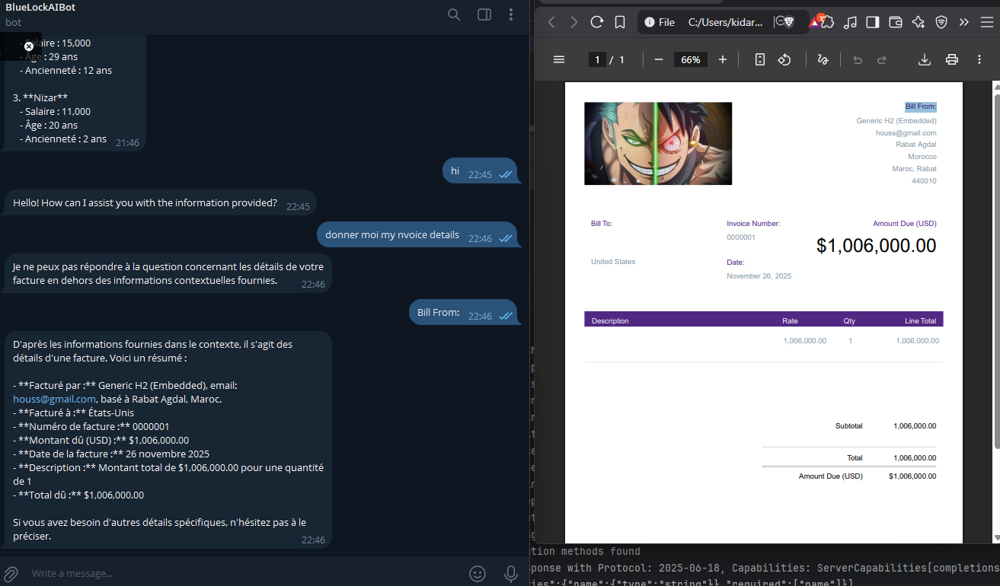 | 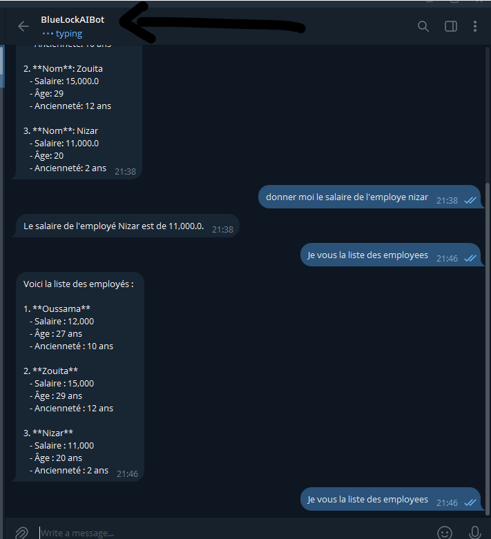 |  |

---

